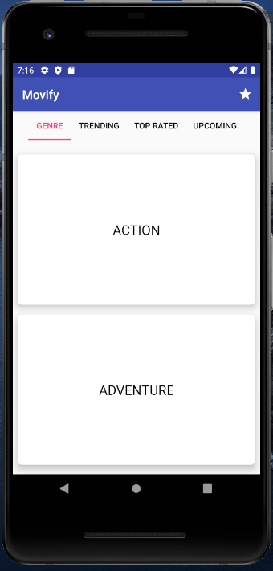
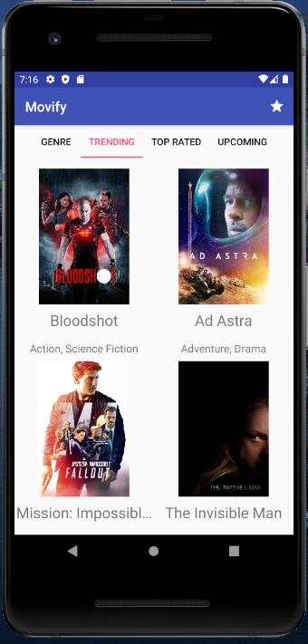
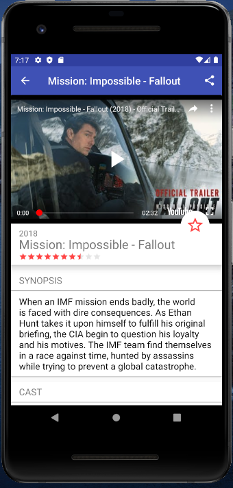
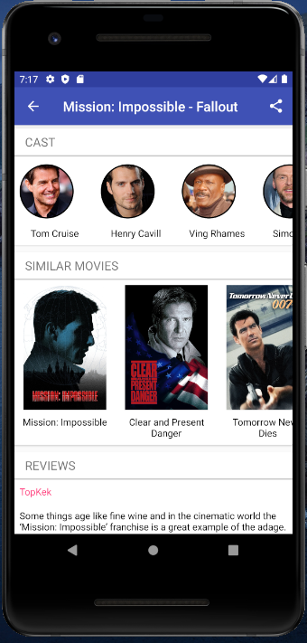
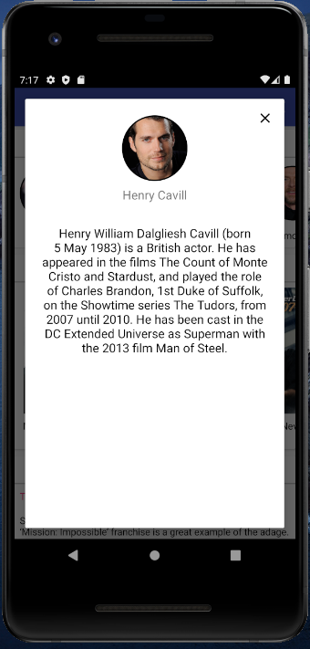
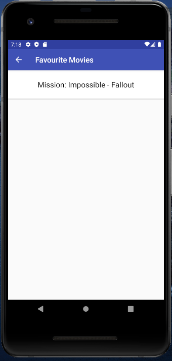

# Movify

#### An android app that allows user to learn about latest trending movies, watch trailers, bookmark favourite movies and share with friends.

#### Data source : [TmDb API](https://developers.themoviedb.org/3/getting-started/introduction) for movie data and [Youtube Android Player API](https://developers.google.com/youtube/android/player) for trailers

### To Run Locally :
1. Clone the repository `git clone https://github.com/NKwatra/Movify.git`
2. Get your own copy of [TmDb Api](https://developers.themoviedb.org/3/getting-started/introduction) and [Youtube Android Player Api](https://developers.google.com/youtube/android/player#Getting_Started).
3. Create gradle.properties file in root folder of repository `touch gradle.properties`.
4. Add below 2 lines to gradle.properties :

    ``` 
        API_KEY = <<your api key >>

        YOUTUBE_API_KEY = << your api key >> 
    ```
5. Rebuild the project and run the app.



 



     



